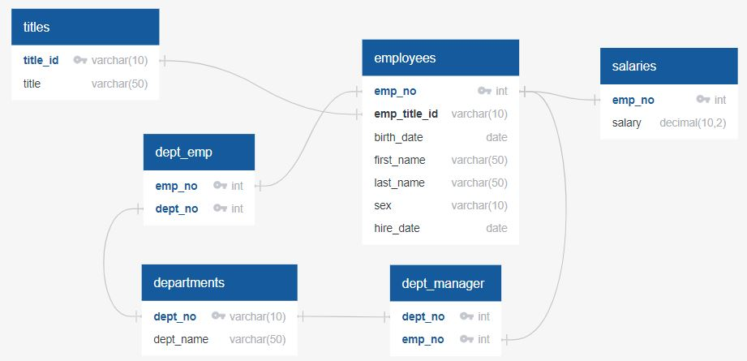

# Module-09-Challenge | sql-challenge

## Summary
I was asked to design a SQL DB from provided CSV files then run some statements to answer a few given questions. New job new me here at HP! Yeahh~

## Data Modeling
Developed a Entity Relationship Diagram E.R.D. to assist in this task:
I did so by ueing https://app.quickdatabasediagrams.com/

     
   
   Site code to create ERD

                    titles
                    --
                    title_id varchar(10) PK
                    title varchar(50)

                    employees
                    --
                    emp_no int PK
                    emp_title_id varchar(10) FK - titles.title_id 
                    birth_date date
                    first_name varchar(50)
                    last_name varchar(50)
                    sex varchar(10)
                    hire_date date

                    departments
                    --
                    dept_no varchar(10) PK
                    dept_name varchar(50)

                    dept_manager
                    --
                    dept_no int PK FK - departments.dept_no
                    emp_no int PK FK - employees.emp_no

                    dept_emp
                    --
                    emp_no int PK FK - employees.emp_no
                    dept_no int PK FK - departments.dept_no

                    salaries
                    --
                    emp_no int PK FK - employees.emp_no
                    salary decimal(10,2)

## Data Engineering
I then needed to get to work makeing the tables in Postgress. First I replicate the provided csv sheets into tables in Postgres (pg Admin 4). I did so by putting the following SQL code in the Postgres query tool.

Code to create tables in Postgress:
        
        CREATE TABLE titles(
            title_id VARCHAR PRIMARY KEY,
            title VARCHAR
        );

        CREATE TABLE employees ( 
            emp_no INT PRIMARY KEY,
            emp_title_id VARCHAR,
            birth_date DATE,
            frist_name VARCHAR,
            last_name VARCHAR,
            sex VARCHAR,
            hire_date DATE,
            FOREIGN KEY (emp_title_id) REFERENCES titles (title_id)
        );
 
        CREATE TABLE departments ( 
            dept_no VARCHAR PRIMARY KEY,
            dept_name VARCHAR
        );

        CREATE TABLE dept_manager ( 
            dept_no VARCHAR,
            emp_no INT,
            FOREIGN KEY (emp_no) REFERENCES employees (emp_no),
            FOREIGN KEY (dept_no) REFERENCES departments (dept_no),
            PRIMARY KEY (emp_no, dept_no)
        );

        CREATE TABLE dept_emp ( 
            emp_no INT,
            dept_no VARCHAR,
            FOREIGN KEY (emp_no) REFERENCES employees (emp_no),
            FOREIGN KEY (dept_no) REFERENCES departments (dept_no),
            PRIMARY KEY (emp_no, dept_no)
        );

        CREATE TABLE salaries ( 
            emp_no INT PRIMARY KEY,
            salary INT,
            FOREIGN KEY (emp_no) REFERENCES employees (emp_no)
        );
        
        
        --check tables by running
        
        SELECT * FROM salaries;
        SELECT * FROM dept_emp;
        SELECT * FROM dept_manager;
        SELECT * FROM departments;
        SELECT * FROM employees;
        SELECT * FROM titles;
        
Setup is complete!       

## Data Analysis
Now maybe we can get to the questions at hand! In which case I needed this entire setup, I would never be able to answer this with pivotables in excel or MS access. 

1. List the employee number, last name, first name, sex, and salary of each employee.

	SELECT employees.emp_no, employees.last_name, employees.frist_name, employees.sex, salaries.salary
        From employees
        LEFT JOIN salaries
        ON employees.emp_no = salaries.emp_no
        ORDER BY employees.emp_no;`
	
2. List the first name, last name, and hire date for the employees who were hired in 1986.

        SELECT Frist_name, last_name, hire_date
        FROM employees
        WHERE hire_date BETWEEN '1986-01-01' AND '1986-12-31'
        ORDER BY hire_date;

3. List the manager of each department along with their department number, department name, employee number, last name, and first name.

        SELECT dept_manager.dept_no, departments.dept_name, employees.emp_no, employees.last_name, employees.frist_name
        FROM dept_manager
        INNER JOIN departments
        ON dept_manager.dept_no = departments.dept_no
        INNER JOIN employees
        ON employees.emp_no = dept_manager.emp_no
        ORDER BY dept_name;

4. List the department number for each employee along with that employee’s employee number, last name, first name, and department name.

        SELECT departments.dept_no, departments.dept_name, employees.emp_no, employees.last_name, employees.frist_name
        FROM employees
        INNER JOIN dept_emp
        ON employees.emp_no = dept_emp.emp_no
        INNER JOIN departments 
        ON departments.dept_no = dept_emp.dept_no
        ORDER BY departments.dept_no;

5. List first name, last name, and sex of each employee whose first name is Hercules and whose last name begins with the letter B.

        SELECT frist_name, last_name, sex
        FROM employees 
        WHERE frist_name = 'Hercules'
        AND last_name LIKE 'B%';

6. List each employee in the Sales department, including their employee number, last name, and first name.

        SELECT departments.dept_name, employees.emp_no, employees.last_name, employees.frist_name
        FROM employees
        INNER JOIN dept_emp
        ON employees.emp_no = dept_emp.emp_no
        INNER JOIN departments 
        ON departments.dept_no = dept_emp.dept_no
        WHERE departments.dept_name = 'Sales'
        ORDER BY employees.last_name;

7. List each employee in the Sales and Development departments, including their employee number, last name, first name, and department name.

        SELECT departments.dept_name, employees.emp_no, employees.last_name, employees.frist_name
        FROM employees
        INNER JOIN dept_emp
        ON employees.emp_no = dept_emp.emp_no
        INNER JOIN departments 
        ON departments.dept_no = dept_emp.dept_no
        WHERE departments.dept_name = 'Sales' OR departments.dept_name = 'Development'
        ORDER BY employees.last_name;

8. List the frequency counts, in descending order, of all the employee last names (that is, how many employees share each last name).   

        SELECT last_name, COUNT(last_name)
        FROM employees
        GROUP BY last_name
        ORDER BY COUNT(last_name)
        DESC;
        
There you go sir, all questions answered.

…? What’s that!?  you want my take aways? 
	Well…
-	You got way too many people with the same last name and way too many named Hercules.
-	Your top heavy in salaries  
-	You really should organize your department needs based on demand. Older hires have filled your employees count. 
